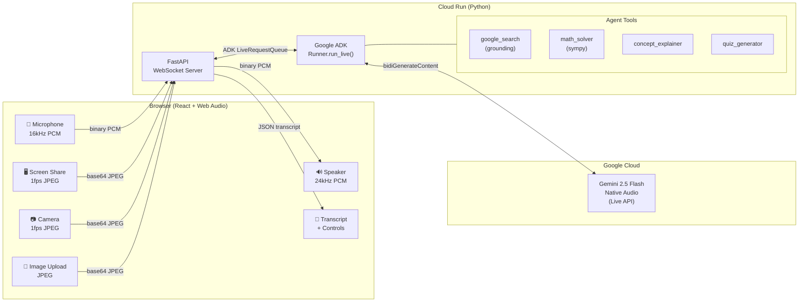

# Vision Tutor - Architecture



## Data Flow

### Audio Pipeline
```
Mic → getUserMedia(16kHz) → AudioWorklet(Float32→Int16) → WebSocket(binary) → ADK.send_realtime(Blob) → Gemini
Gemini → ADK events → WebSocket(binary) → AudioWorklet(Int16→Float32, ring buffer) → AudioContext(24kHz) → Speaker
```

### Vision Pipeline
```
Screen/Camera → canvas(1fps) → toDataURL(JPEG, 0.7) → base64 → WebSocket(JSON) → base64.decode → ADK.send_realtime(Blob) → Gemini
Image Upload → FileReader → base64 → WebSocket(JSON) → same path
```

### WebSocket Protocol
| Direction | Format | Content |
|-----------|--------|---------|
| Client → Server | Binary | Raw PCM audio (16kHz, Int16, mono) |
| Client → Server | JSON | `{type: "video_frame", data: "<base64>"}` |
| Client → Server | JSON | `{type: "text_input", text: "..."}` |
| Server → Client | Binary | Raw PCM audio (24kHz, Int16, mono) |
| Server → Client | JSON | `{type: "transcript", role, text}` |
| Server → Client | JSON | `{type: "status", status: "turn_complete\|interrupted"}` |
